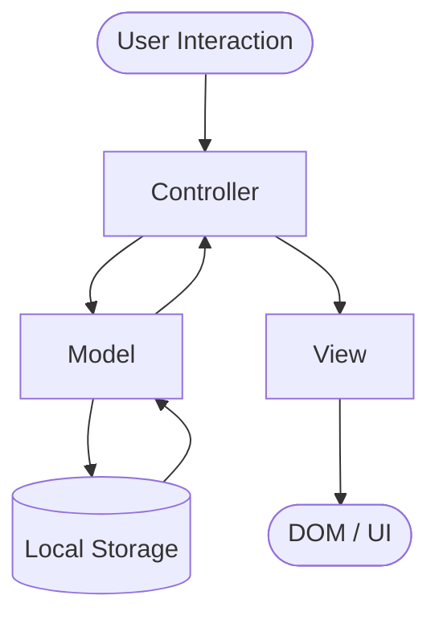

# Design Document: Personal Budget Tracker

## Overview

A client-side personal budget tracker built with HTML, CSS, and Vanilla JavaScript. All data is stored in the browser's Local Storage — no backend, no build tools, no dependencies. The app runs as a standalone HTML file (or browser extension) and provides transaction management, monthly summaries, category breakdowns with a pie chart, sorting, custom categories, budget limits, and a dark/light mode toggle.

The architecture is a single-page application (SPA) pattern without a framework: one HTML file, one CSS file (`css/style.css`), and one JavaScript file (`js/app.js`). State is held in memory during a session and synced to Local Storage on every mutation.

---

## Architecture

The app follows a simple **Model → View → Controller** pattern implemented in plain JavaScript:

- **Model**: Pure data functions that read/write to Local Storage and compute derived values (totals, breakdowns, filtered lists).
- **View**: Functions that generate or update DOM nodes from data. No direct DOM manipulation outside view functions.
- **Controller**: Event listeners that call model functions and then call view functions to re-render affected sections.



State is never read directly from the DOM — the in-memory state object is the single source of truth, hydrated from Local Storage on startup.

### Module Boundaries (within js/app.js)

Since the constraint is a single JS file, logical separation is achieved through clearly named function groups:

| Group | Responsibility |
|---|---|
| `storage.*` | Read/write Local Storage |
| `state.*` | In-memory state management |
| `model.*` | Business logic (totals, validation, filtering) |
| `view.*` | DOM rendering |
| `controller.*` | Event wiring and orchestration |
| `chart.*` | Pie chart drawing (Canvas API) |

---

## Components and Interfaces

### 1. Transaction Form

Inputs: `amount` (number), `type` (income/expense radio), `category` (select), `description` (text), `date` (date).

- Validates all fields on submit before saving.
- Inline error messages per field.
- Resets after successful save.

### 2. Month Navigator

A prev/next control plus a month/year label. Changing the month updates the active month in state and triggers re-render of the transaction list, summary panel, and pie chart.

### 3. Transaction List

Renders a `<ul>` of transaction cards. Each card shows description, category badge, amount (color-coded income/expense), date, and a delete button. Supports sort controls (amount asc/desc, category A–Z). Sort is view-only — does not mutate stored data.

### 4. Monthly Summary Panel

Displays: total income, total expenses, net balance (with surplus/deficit indicator), budget amount, remaining budget, and a budget-exceeded warning when applicable.

### 5. Pie Chart (Canvas)

Drawn on a `<canvas>` element using the 2D Canvas API — no external chart library. Segments are colored per category. A legend list alongside shows category name, total amount, and percentage.

### 6. Category Manager

A small inline form to add custom categories. Validates for empty name and case-insensitive duplicates. Renders the current category list.

### 7. Budget Input

An inline input in the summary panel to set the monthly budget. Validates for positive numeric value. Saves per-month to Local Storage.

### 8. Dark/Light Mode Toggle

A toggle button that adds/removes a `data-theme="dark"` attribute on `<html>`. Preference is saved to Local Storage.

---

## Data Models

All data is serialized as JSON in Local Storage under fixed keys.

### Transaction

```js
{
  id: string,          // crypto.randomUUID() or Date.now().toString()
  type: "income" | "expense",
  amount: number,      // positive float, > 0
  category: string,    // category name
  description: string, // non-empty string
  date: string         // ISO 8601 date string "YYYY-MM-DD"
}
```

### Category

```js
{
  name: string,        // unique, case-insensitive
  isDefault: boolean   // true for built-in categories
}
```

Default categories: `["Food", "Transport", "Entertainment", "Health", "Shopping", "Other"]`

### MonthlyBudget

```js
{
  monthKey: string,    // "YYYY-MM" format
  amount: number       // positive float
}
```

### AppState (in-memory)

```js
{
  transactions: Transaction[],
  categories: Category[],
  budgets: MonthlyBudget[],
  activeMonth: string,   // "YYYY-MM"
  theme: "light" | "dark",
  sortBy: "date-desc" | "amount-asc" | "amount-desc" | "category-asc"
}
```

### Local Storage Keys

| Key | Value |
|---|---|
| `pbt_transactions` | `Transaction[]` JSON |
| `pbt_categories` | `Category[]` JSON |
| `pbt_budgets` | `MonthlyBudget[]` JSON |
| `pbt_theme` | `"light"` or `"dark"` |

### Derived Values (computed, not stored)

- `totalIncome(month)` — sum of income transactions for month
- `totalExpenses(month)` — sum of expense transactions for month
- `netBalance(month)` — totalIncome − totalExpenses
- `categoryBreakdown(month)` — `{ category: string, total: number, pct: number }[]`
- `remainingBudget(month)` — budget.amount − totalExpenses(month)

---

## Correctness Properties

*A property is a characteristic or behavior that should hold true across all valid executions of a system — essentially, a formal statement about what the system should do. Properties serve as the bridge between human-readable specifications and machine-verifiable correctness guarantees.*


### Property 1: Valid Transaction Save Round-Trip

*For any* valid transaction (non-empty description, positive amount, valid category, valid date), saving it should result in it being retrievable from Local Storage and appearing in the transaction list for its month.

**Validates: Requirements 1.2, 9.1**

### Property 2: Invalid Transaction Rejected on Empty Fields

*For any* transaction submission where one or more required fields (amount, category, description, date) are empty or missing, the save operation should be rejected and Local Storage should remain unchanged.

**Validates: Requirements 1.3**

### Property 3: Non-Positive Amount Rejected

*For any* amount value that is zero, negative, or non-numeric, the transaction form should reject the input and Local Storage should remain unchanged.

**Validates: Requirements 1.4**

### Property 4: Summary Totals Correctness

*For any* set of transactions in a given month, the displayed total income should equal the sum of all income transaction amounts, total expenses should equal the sum of all expense transaction amounts, and net balance should equal total income minus total expenses.

**Validates: Requirements 2.4, 5.1**

### Property 5: Month Filter Correctness

*For any* selected month and any set of transactions, the transaction list should contain exactly those transactions whose date falls within that calendar month — no more, no fewer.

**Validates: Requirements 2.2**

### Property 6: Delete Transaction Round-Trip

*For any* transaction that exists in Local Storage, deleting it should result in it no longer being present in Local Storage and no longer appearing in the transaction list.

**Validates: Requirements 3.2**

### Property 7: Category Breakdown Percentages

*For any* set of expense transactions in a given month, the category breakdown should assign each category a percentage such that all percentages sum to 100%, and each category's percentage equals its total divided by the grand total of all expenses.

**Validates: Requirements 4.3, 4.5**

### Property 8: Net Balance Surplus/Deficit Indicator

*For any* computed net balance, the visual indicator should show "surplus" when net balance is strictly positive and "deficit" when net balance is zero or negative.

**Validates: Requirements 5.3**

### Property 9: Budget Save and Remaining Budget Calculation

*For any* valid budget amount set for a month, the budget should be persisted to Local Storage and the displayed remaining budget should equal the budget amount minus total expenses for that month.

**Validates: Requirements 6.2**

### Property 10: Budget Exceeded Warning

*For any* month where total expenses exceed the set budget, the budget-exceeded warning should be displayed; when total expenses are at or below the budget, the warning should not be displayed.

**Validates: Requirements 6.3**

### Property 11: Non-Positive Budget Rejected

*For any* budget value that is zero, negative, or non-numeric, the budget input should be rejected and Local Storage should remain unchanged.

**Validates: Requirements 6.4**

### Property 12: Sort Order Correctness and Storage Immutability

*For any* transaction list and any selected sort option (amount ascending, amount descending, category alphabetical), the displayed order should match the sort criteria, and the transactions stored in Local Storage should be identical before and after sorting.

**Validates: Requirements 7.2**

### Property 13: Sort Reset on Month Change

*For any* active sort order, navigating to a different month should reset the sort order to date-descending.

**Validates: Requirements 7.3**

### Property 14: Custom Category Save Round-Trip

*For any* valid custom category name (non-empty, non-duplicate), adding it should persist it to Local Storage and make it available as an option in the category selector.

**Validates: Requirements 8.3**

### Property 15: Invalid Category Name Rejected

*For any* category name that is empty, composed entirely of whitespace, or matches an existing category name (case-insensitive), the add-category operation should be rejected and Local Storage should remain unchanged.

**Validates: Requirements 8.4, 8.5**

### Property 16: Persistence Round-Trip

*For any* app state (transactions, categories, budgets, theme), serializing it to Local Storage and then deserializing it on app load should produce an equivalent state with no data loss or corruption.

**Validates: Requirements 9.1, 9.2**

### Property 17: Summary Updates After Transaction Save

*For any* transaction saved to a given month, the monthly summary totals (income, expenses, net balance) displayed immediately after saving should reflect the newly added transaction without requiring a page reload.

**Validates: Requirements 1.5**

---

## Error Handling

| Scenario | Handling |
|---|---|
| Local Storage unavailable (SecurityError) | Catch on read/write, show non-blocking toast, run with in-memory state only |
| Local Storage parse error (corrupt JSON) | Catch JSON.parse error, log warning, initialize that key with empty default |
| Transaction form validation failure | Inline error message per field, focus first invalid field, do not save |
| Budget input validation failure | Inline error below budget input, do not save |
| Custom category validation failure | Inline error below category input, do not save |
| Pie chart with no expense data | Hide canvas, show placeholder text "No expense data for this month" |
| Empty transaction list for month | Show empty state message "No transactions recorded for this month" |
| Amount field: non-numeric input | HTML `type="number"` + JS validation, show "Amount must be a positive number" |

All validation errors are displayed inline (adjacent to the relevant input) and cleared when the user corrects the input. No modal dialogs for validation.

---

## Testing Strategy

### Dual Testing Approach

Both unit tests and property-based tests are required. They are complementary:
- Unit tests catch concrete bugs with specific known inputs and edge cases.
- Property-based tests verify general correctness across a wide range of generated inputs.

### Property-Based Testing

**Library**: [fast-check](https://github.com/dubzzz/fast-check) (JavaScript, no build required via CDN or npm).

Each correctness property defined above maps to exactly one property-based test. Tests run a minimum of 100 iterations each.

Tag format for each test:
```
// Feature: personal-budget-tracker, Property N: <property_text>
```

Example:
```js
// Feature: personal-budget-tracker, Property 5: Month filter correctness
fc.assert(
  fc.property(
    fc.array(arbitraryTransaction()),
    fc.string({ minLength: 7, maxLength: 7 }), // "YYYY-MM"
    (transactions, month) => {
      const filtered = model.filterByMonth(transactions, month);
      return filtered.every(t => t.date.startsWith(month));
    }
  ),
  { numRuns: 100 }
);
```

**Properties to implement as PBT tests** (one test per property):

| Test | Property | Requirements |
|---|---|---|
| PBT-1 | Valid transaction save round-trip | 1.2, 9.1 |
| PBT-2 | Invalid transaction rejected on empty fields | 1.3 |
| PBT-3 | Non-positive amount rejected | 1.4 |
| PBT-4 | Summary totals correctness | 2.4, 5.1 |
| PBT-5 | Month filter correctness | 2.2 |
| PBT-6 | Delete transaction round-trip | 3.2 |
| PBT-7 | Category breakdown percentages | 4.3, 4.5 |
| PBT-8 | Net balance surplus/deficit indicator | 5.3 |
| PBT-9 | Budget save and remaining budget calculation | 6.2 |
| PBT-10 | Budget exceeded warning | 6.3 |
| PBT-11 | Non-positive budget rejected | 6.4 |
| PBT-12 | Sort order correctness and storage immutability | 7.2 |
| PBT-13 | Sort reset on month change | 7.3 |
| PBT-14 | Custom category save round-trip | 8.3 |
| PBT-15 | Invalid category name rejected | 8.4, 8.5 |
| PBT-16 | Persistence round-trip | 9.1, 9.2 |
| PBT-17 | Summary updates after transaction save | 1.5 |

### Unit Tests

Unit tests focus on specific examples, edge cases, and integration points that property tests don't cover well:

- **Empty state**: App loads with no Local Storage data → renders empty state messages correctly.
- **Default categories**: On first load, exactly the 6 default categories are present.
- **No expense data**: Pie chart placeholder shown when month has only income transactions.
- **Budget input UI**: Budget input field is present in the summary panel.
- **Delete control presence**: Every rendered transaction card has a delete button.
- **Local Storage parse error**: Corrupt JSON in `pbt_transactions` → app initializes with empty transaction list and shows error toast.
- **Local Storage unavailable**: `localStorage.setItem` throws → app continues with in-memory state.
- **Dark/light mode toggle**: Toggling saves preference to Local Storage and applies `data-theme` attribute.

### Test File Structure

Since the constraint is no test setup required (NFR-1), tests are written as plain JS assertions runnable in the browser console or via a minimal test runner (e.g., a `test/` directory with a simple `test/index.html` that loads fast-check from CDN and runs all tests, logging results to the console).

```
test/
  index.html     ← loads fast-check CDN + test files
  index.js       ← all unit + property tests
```

The model functions (validators, filters, calculators) must be pure functions so they can be tested without DOM or Local Storage dependencies. The `js/app.js` file should expose these via a `window.model` object when running in test mode (detected via a `?test=1` query param or a global flag).
